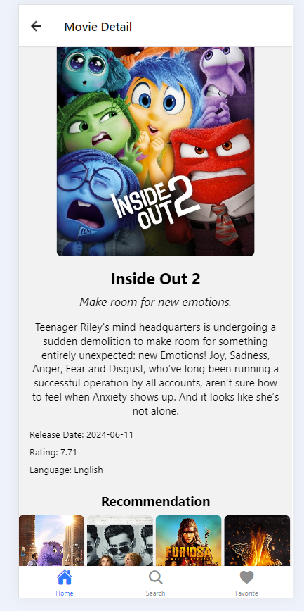
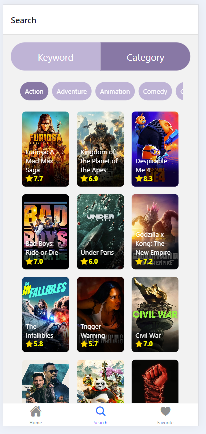

# ProgateMovieApp

ProgateMovieApp is a React Native application that fetches and displays information about movies using The Movie Database (TMDb) API.

## Table of Contents

- [Installation](#installation)
- [Features](#features)

## Installation

Follow these steps to get the project up and running on your local machine:

1. **Clone the repository:**
   ```bash
   git clone https://github.com/nurulaamalia/progate-react-native-movie-app.git
2. **Navigate to the project directory:**
   ```bash
   cd movie-app
3. **Install dependencies:**
   ```bash
   npm install
4.  **Create a .env file in the root of your project and add your TMDb API key:**
    ```bash
    API_ACCESS_TOKEN=your_actual_api_access_token_here
5. **Start the Expo development server:**
   ```bash
   npx expo start
## Features

ProgateWeatherApp includes the following features:

### Home Screen:
The home screen displays various categories of movies, including:

- **Now Playing in Theater**: Shows the latest movies currently playing in theaters.
- **Upcoming Movies**: Displays movies that are set to be released soon.
- **Top Rated Movies**: Features movies with the highest ratings.
- **Popular Movies**: Lists the most popular movies.

### Searching for Movies:
Users can search for movies using keywords and genres then view the results in a grid layout.

### Viewing Movie Details:
Users can view detailed information about a selected movie, including title, overview, release date, and rating. The detail screen also displays recommended movies based on the selected movie.

### Favorite Movies:
Users can mark movies as favorites and view their list of favorite movies. The favorites are stored persistently using Async Storage.

### Error Handling:
Users are notified if there is an error in fetching the movie data.

### Navigating Between Screens:
Users can navigate between different screens, such as Home, Search, and Favorites, using a bottom tab navigator.

## Example Screen




